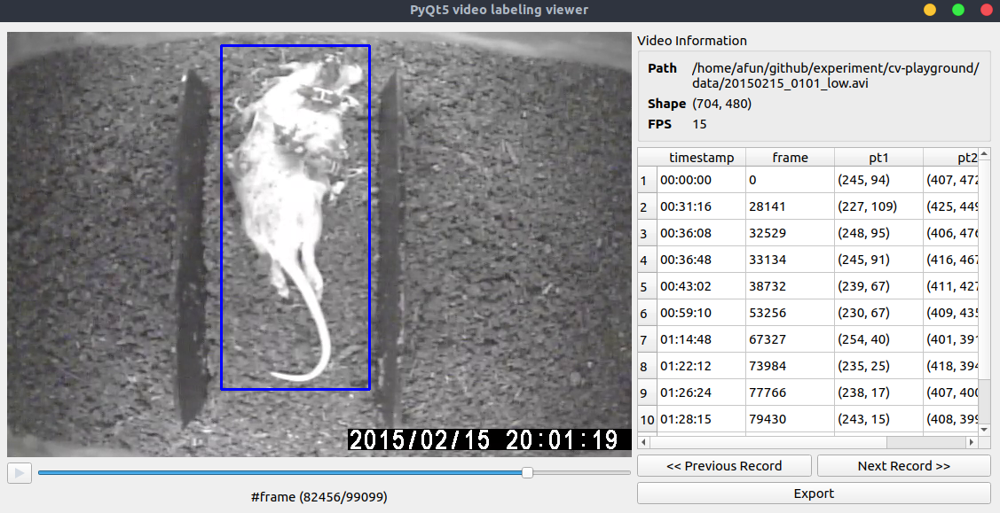

# pyqt5-video-labeling



This tool is available to label in video (only bounding box so far).

## Dependencies

Develop the application with [`pipenv`](https://github.com/pypa/pipenv) + `python 3.6.5` as follow, or you can simply install the `pyqt5` and `opencv`

```
better-exceptions==0.2.1
opencv-python==3.4.3.18
  - numpy [required: >=1.11.3, installed: 1.15.1]
pandas==0.23.4
  - numpy [required: >=1.9.0, installed: 1.15.1]
  - python-dateutil [required: >=2.5.0, installed: 2.7.3]
    - six [required: >=1.5, installed: 1.11.0]
  - pytz [required: >=2011k, installed: 2018.5]
pylint==2.1.1
  - astroid [required: >=2.0.0, installed: 2.0.4]
    - lazy-object-proxy [required: Any, installed: 1.3.1]
    - six [required: Any, installed: 1.11.0]
    - typed-ast [required: Any, installed: 1.1.0]
    - wrapt [required: Any, installed: 1.10.11]
  - isort [required: >=4.2.5, installed: 4.3.4]
  - mccabe [required: Any, installed: 0.6.1]
PyQt5==5.11.2
  - PyQt5-sip [required: <4.20,>=4.19.11, installed: 4.19.12]
PyYAML==3.13
```

## Install

Require [`pipenv`](https://github.com/pypa/pipenv) to install dependecy

```
$ git clone https://github.com/afunTW/pyqt5-video-labeling
$ cd pyqt5-video-labeling
$ pipenv sync
```

## Usage

```
$ python3 main.py -h
usage: main.py [-h] [-v VIDEO] [-c CONFIG] [-o OUTPUT]

optional arguments:
  -h, --help            show this help message and exit
  -v VIDEO, --video VIDEO
  -c CONFIG, --config CONFIG
  -o OUTPUT, --output OUTPUT
```

## Functionality

| event | target | function |
| ----- | ------ | -------- |
| RIGHT_CLICK | a record on the frame | DELETE |
| DOUBLE CLICK | a record on the right table widget | skip to frame|
| KEY_SPACE or KEY_P | KEYBOARD | play video |
| KEY_RIGHT or KEY_D | KEYBOARD | skip to next second frame |
| KEY_LEFT or KEY_A | KEYBOARD | skip to previous second frame |

More configuration can be modified in `config.yaml`, including

- color, thickness, line_style in drawing mode
- color, thickness, line_style in selecting mode
- color, thickness in label
- limit number of labels in single frame